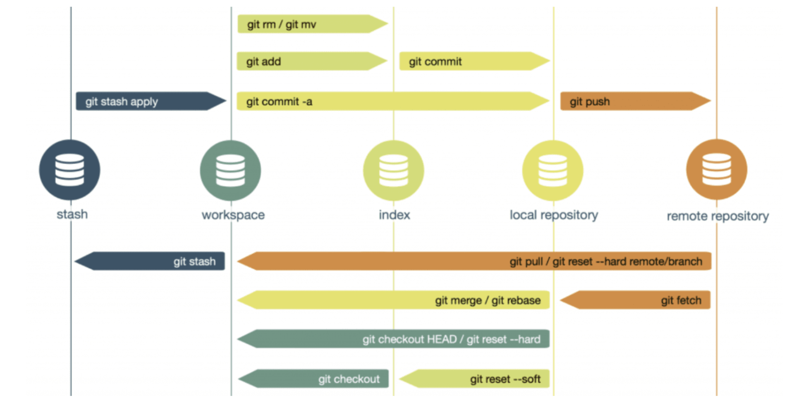

# 1132DBMS_Group2

> Update : 0430 21:00

- 111304019 統計三 林承佑
- 111304012 統計三 尹沛綸
- 113363014 企研碩一 李昕怡
- 109303064 會計四 胡勛明
- 111208023 經濟三 陳以薰

---

**目錄**

[起始步驟](#起始步驟)
[Git 簡易教學](#Git簡易教學)

---

# 起始步驟

簡單說明一下要怎麼開始這份專案到自己本地端的電腦上！然後就可以「隨時」在本地端透過敲代碼來協作啦～

> 下面說明的終端機就指terminal，也可以用自己喜歡的iTerm2 之類的，和一些美化軟體讓它看起來不（ㄏㄣˇ）乏（ㄒㄩㄢˋ）味（ㄆㄠˋ）。

1. 開啟終端機，將位置定位在想要放專案的資料夾下，把路徑放在相對位置後面就可以了：

```
cd ./
```

> 如果是家目錄底下則用`~/`開頭

2. 在終端機輸入：

```
git clone git@github.com:ChengYouLin/1132DBMS_Group2.git
```

3. 基本上完成後就會把當前所有的資料夾放到第一步所指定的資料夾中，可以透過`ls`的指令來看當前目錄下的內容（如果想看隱藏檔案則是`ls -a`）；再把位置切換`cd`進去該資料夾中，就會發現已經是有git 的狀態！

> 建議大家參考一下後面的branch命名方式，以便協作！（如果我有寫完且記得，我會回來這裡補連結）

---

# Git 簡易說明

這裡提供大家常用的git 語法跟白話的功能解釋，有幫助的話就參考唄！（反正久了終端機就會有記憶可以瘋狂右鍵或Enter）

> 終端機可以在 '~/.zshrc' 檔案中設定一些好用的工具，歡迎入坑！另外透過方向鍵的上下可以看之前打過的紀錄～

> 因為我們是直接協作專案，就沒有特別做本地端初始化的動作；如果有興趣或想要練習可以參考助教影片，我覺得可以從情境想想看需要的指令，然後查資料或問GPT。



- 從右至左：
  - **remote repo** : 這份專案就是指github，只要沒有放上來，就沒有人知道你貢獻了多少，所以有修正就可以丟上來（類似雲端）
    - 就算是分支也可以讓別人看到你做了什麼！
    - 已經完成或成型的功能或畫面之類的，才會被合併到main這條主幹線
  - **local repo** : 就是最一開始我們做的clone的動作，將專案放到自己電腦上某個很深的資料夾中，只要進入這裡面就是自己本地的repo
    - 可以任意開啟並設定分支，然後進行實作，只要沒有push上去遠端就沒有人知道。
    - 如果有間隔地完成自己的實作部分，可以通過git diff 或 git pull 來抓遠端的資料下來看看有什麼不同或新的！避免自己做得很開心結果別人已經弄好，或是無法合併到現有的功能之中
  - **workspace 和 index** : 這裡就像助教課提到的圖片的操作，也就是每一個操作步驟會落在哪個環節或概念，只要知道指令順序和流程就好。
    - Untrack: git 從來沒看過的東西
    - Unmodified: 跟先前commit 的相同沒有改變
    - Modified: 已經修改過了但還沒有加入紀錄（登記）
    - Stage: 登記好所有改過的內容，幫他們編號（也就是進入index的環節）
  - **stash** : 就是暫存一些暫時沒有要推去遠端，但也還沒完成沒有要登記起來乃至註解的動作，直到可能先處理完其他分支或其他更重要的關鍵功能，再把它叫出來
    - 就像一個個人的小倉儲，可以把一些沒用的東西先命名然後丟進去，想到的時候再把它翻出來

## 小結

看起來雖然偏複雜，但簡單來說就是在workspace（也就是你在做專案的環節）中，會一直修改很多東西，不限於代碼，也有可能新增檔案、圖片，甚至只是整理資料夾移動位置等。但每個步驟電腦其實都會做記錄，那這些紀錄在協作中也很重要，如果有不小心改錯或者是出現Bug的時候，就需要能夠向前復原！所以我們把每個操作過的步驟都做編號，也就是登記一下號碼是多少，也就是index（`git add`）。但號碼我們又看不懂，所以要再做文字上的備注說明，也就是`git commit`

換言之，我們在「本地端的repo」中，建立了一個「自己的分支」，然後把「每個動作登記成號碼」並且「用文字備注」，最後才推上遠端跟大家說我做了什麼！

> 以上就是我對這個git功能的小見解，希望可以幫助各位快速理解他到底在幹嘛！（也有可能解釋的有誤...）

## 指令整理

> 有時間就會盡力補齊內容，沒有的話就看看助教課講義或找小雀同學吧...

1. 新增分支 Branch

- 本地端也會有一個main，我們希望讓main 是主幹道，如果還在實作（創作）或測試的過程，就不要合併到主幹道。
- 可以自己建立一個分支，把現在所有主幹道的東西複製一份到旁邊的小道，然後加入自己的實作內容。
  - 建立有命名方式，請參考後面某個小節！

```
git branch
```

> 只輸入上述內容可以看到目前有的所有分支和主幹道。

> 後面加上分支的名字即可新增，例如: `git branch doc/cyLin/readme-update`

> 加上`-D`再加上想刪除的分支名字，可以強制刪除！

2. 切換目前的道路

- 可以轉換到不同的道路上，但記得該道路如果有修改過就要commit 或把還沒修改好的東西丟到stash

```
git switch
```

> 後面加上分支的名字即可切換，例如: `git switch doc/cyLin/readme-update`

> 也可以在後面加上 -c ，就可以直接建立分支並切換過去！(如果有就切換沒有就建立後切換) `git switch -c doc/cyLin/readme-update`

3. 查看目前修改的狀態

- 也就是如果有在該分支底下做過什麼動作，除了單純新增一個資料夾外，就會有記錄
  - 如果有記錄，就建議做`git add`並且`git commit`說明

```
git status
```

4. 編號和紀錄操作的內容

- 把每個步驟都記錄起來，尤其有大功能在改版或創新時，這樣如果有bug 比較容易回朔！

```
git add .
```

> 後面可以直接用`.`或者是`檔案名稱`。例如：`git add README.md`

```
git commit
```

> 如果直接輸入這行通常會跳到vim編輯器當中，如果有預設的可以用預設的，然後輸入`:wq`儲存退出並enter!
> 也可以利用`-m`在後面直接加上註解的內容，例如：`git commit -m "Add: 新增初始化區塊"`

5. 查看這條道路上過去的所有痕跡

```
git log
```

> 可以如同助教課加上`--oneline`處理！

6. 把別人的道路內容合併進來

- 這裡是指把對方的內容合併到我這條道路上！

```
git merge
```

> 後面加上想合併的那條分支（或主幹）'git merge main'，合併後也可以做一下登記和紀錄！

7. 把本地端的東西推到遠端Github

- 遠端的分支跟本地的分支沒有直接關係
  - 本地做的事，雲端才不會知道你幹嘛了
  - 換言之，雲端改了這條道路的名字，本地端也不會知道也沒有影響
    - 這裡可以理解遠端跟本地都有各自的main，而遠端的main正是這個專案的核心協作的結晶！
- 如果在該分支有推過一次，就可以只輸入前面的部分，他會推在同一個遠端的分支

```
git push -u origin
```

> 後面加上你遠端的分支要用的名稱，例如: `git push -u origin doc/cyLin/readme-update`

> 這裡的`-u`是指持續追蹤的意思；則`origin`是我們為遠端github的命名

8. 把遠端的東西拉下來本地端

- 有推就有拉，也就是別人可能協作了什麼部分，不論是在他的分支還是已經申請PR，你都可以把現況的結果拉下來到本地端
- 這樣本地端的專案狀態就會更新（通常會拉到本地的main）
  - 你在分支測試的時候也可以把本地最新的狀態合併進來，然後對實作的部分測試看看有沒有問題
    - 也可以額外再開一個分支合併實作的功能，成功的話最後再推上同一個遠端的分支！

```
git pull
```

## 大致流程

### 間隔一陣子才回到該分支繼續實作：

```
main <── 更新 ── git pull
  │
  └───> git checkout -b feature/xxx
            │
            ├─> 開發、commit
            │
            ├─> 合併 main（如有更新）
            │     └─> git merge main
            │
            └─> git push origin feature/xxx
                      ↓
                  GitHub 開 PR → 合併到 main

```

### 實作到一半，突然想換分支或要處理bug ，但現階段的東西不適合紀錄或拋棄

```
[工作中未完成]
      │
      ▼
git stash          ← 儲存暫時改動
      │
      ▼
切換到其他分支（修 bug、合併等等）
      │
      ▼
git switch 回來原分支
      │
      ▼
git stash pop      ← 取回改動，繼續工作

```

---

# 專案結構

---

# 資料庫DB架構

---

# Java Doc

## (三層)
