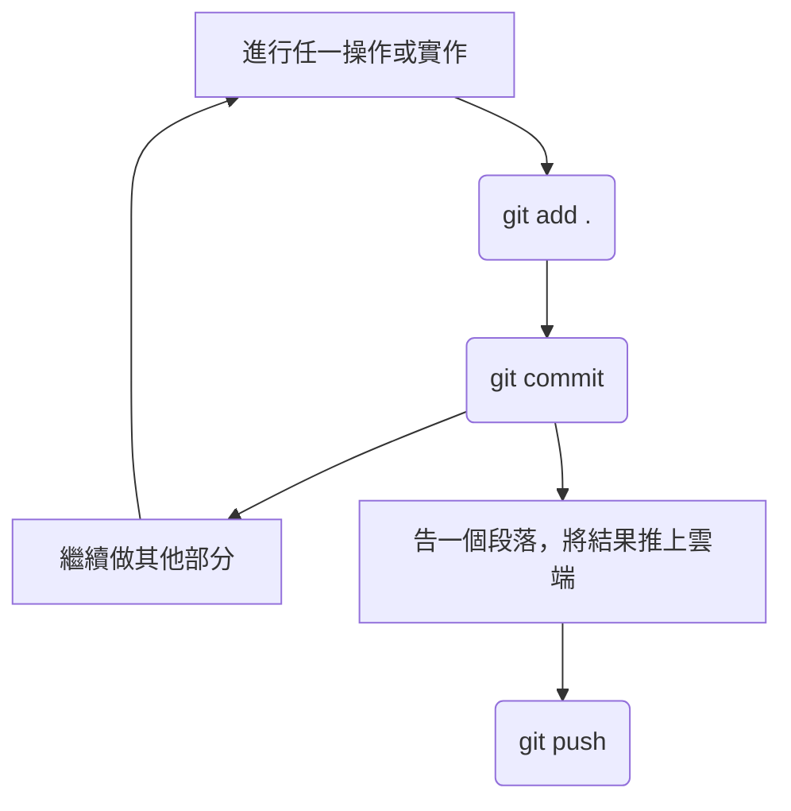
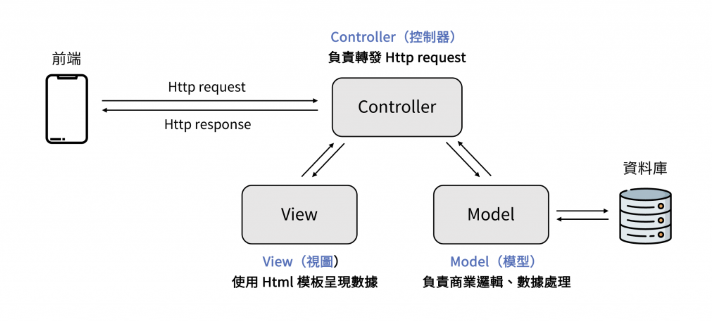
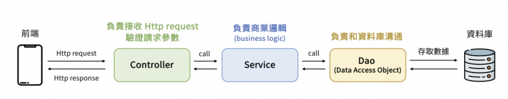

# 1132DBMS_Group2

---
> 以下內容為專案討論與執行過程中的紀錄與教學
> - 記錄在Readme部分的作者：林承佑
> - 記錄在共用google sheet 部分的作者：尹沛綸、林承佑
> - 記錄在共用google doc 部分的作者：胡勛明、林承佑
> - 記錄在共用Canva 部分的作者：陳以薰、李昕怡
---

> Update : 0501 14:30 

- 111304019 統計三 林承佑
- 111304012 統計三 尹沛綸
- 113363014 企研碩一 李昕怡
- 109303064 會計四 胡勛明
- 111208023 經濟三 陳以薰

---

## **目錄**

- [起始步驟](#起始步驟)
- [Git 簡易說明](#git-簡易說明)
  - [小結](#小結)
  - [指令整理](#指令整理)
  - [大致流程](#大致流程)
- [專案結構](#專案結構)
  - [MVC結構（融入Spring boot 常用的 Controller-Service-DAO）](#mvc結構融入spring-boot-常用的-controller-service-dao)
  - [Tree](#tree)
- [資料庫DB架構](#資料庫db架構)
  - [各個表格的MetaData](#各個表格的metadata)
- [Java Doc](#java-doc)
  - [Controller](#controller)
  - [Service](#service)
  - [DAO](#dao)
  - [Model](#model)
- [各個畫面的簡介和URL](#各個畫面的簡介和url)
  - [總表](#總表)
  - [頁面名稱：商品管理頁 `/products`](#頁面名稱商品管理頁-products)
- [PULL Request (PR)](#pull-request-pr)
- [Git Branch 命名方式](#git-branch-命名方式)

---

# 起始步驟

簡單說明一下要怎麼開始這份專案到自己本地端的電腦上！然後就可以「隨時」在本地端透過敲代碼來協作啦～

> 下面說明的終端機就指terminal，也可以用自己喜歡的iTerm2 之類的，和一些美化軟體讓它看起來不（ㄏㄣˇ）乏（ㄒㄩㄢˋ）味（ㄆㄠˋ）。

1. 開啟終端機，將位置定位在想要放專案的資料夾下，把路徑放在相對位置後面就可以了：

```
cd ./
```

> 如果是家目錄底下則用`~/`開頭

2. 在終端機輸入：

```
git clone git@github.com:ChengYouLin/1132DBMS_Group2.git
```

3. 基本上完成後就會把當前所有的資料夾放到第一步所指定的資料夾中，可以透過`ls`的指令來看當前目錄下的內容（如果想看隱藏檔案則是`ls -a`）；再把位置切換`cd`進去該資料夾中，就會發現已經是有git 的狀態！

> 建議大家參考一下後面的branch命名方式，以便協作！（如果我有寫完且記得，我會回來這裡補連結）

---

# Git 簡易說明

這裡提供大家常用的git 語法跟白話的功能解釋，有幫助的話就參考唄！（反正久了終端機就會有記憶可以瘋狂右鍵或Enter）

> 終端機可以在 '~/.zshrc' 檔案中設定一些好用的工具，歡迎入坑！另外透過方向鍵的上下可以看之前打過的紀錄～

> 因為我們是直接協作專案，就沒有特別做本地端初始化的動作；如果有興趣或想要練習可以參考助教影片，我覺得可以從情境想想看需要的指令，然後查資料或問GPT。


- 從右至左：
  - **remote repo** : 這份專案就是指github，只要沒有放上來，就沒有人知道你貢獻了多少，所以有修正就可以丟上來（類似雲端）
    - 就算是分支也可以讓別人看到你做了什麼！
    - 已經完成或成型的功能或畫面之類的，才會被合併到main這條主幹線
  - **local repo** : 就是最一開始我們做的clone的動作，將專案放到自己電腦上某個很深的資料夾中，只要進入這裡面就是自己本地的repo
    - 可以任意開啟並設定分支，然後進行實作，只要沒有push上去遠端就沒有人知道。
    - 如果有間隔地完成自己的實作部分，可以通過git diff 或 git pull 來抓遠端的資料下來看看有什麼不同或新的！避免自己做得很開心結果別人已經弄好，或是無法合併到現有的功能之中
  - **workspace 和 index** : 這裡就像助教課提到的圖片的操作，也就是每一個操作步驟會落在哪個環節或概念，只要知道指令順序和流程就好。
    - Untrack: git 從來沒看過的東西
    - Unmodified: 跟先前commit 的相同沒有改變
    - Modified: 已經修改過了但還沒有加入紀錄（登記）
    - Stage: 登記好所有改過的內容，幫他們編號（也就是進入index的環節）
  - **stash** : 就是暫存一些暫時沒有要推去遠端，但也還沒完成沒有要登記起來乃至註解的動作，直到可能先處理完其他分支或其他更重要的關鍵功能，再把它叫出來
    - 就像一個個人的小倉儲，可以把一些沒用的東西先命名然後丟進去，想到的時候再把它翻出來

## 小結

看起來雖然偏複雜，但簡單來說就是在workspace（也就是你在做專案的環節）中，會一直修改很多東西，不限於代碼，也有可能新增檔案、圖片，甚至只是整理資料夾移動位置等。但每個步驟電腦其實都會做記錄，那這些紀錄在協作中也很重要，如果有不小心改錯或者是出現Bug的時候，就需要能夠向前復原！所以我們把每個操作過的步驟都做編號，也就是登記一下號碼是多少，也就是index（`git add`）。但號碼我們又看不懂，所以要再做文字上的備注說明，也就是`git commit`

換言之，我們在「本地端的repo」中，建立了一個「自己的分支」，然後把「每個動作登記成號碼」並且「用文字備注」，最後才推上遠端跟大家說我做了什麼！

> 以上就是我對這個git功能的小見解，希望可以幫助各位快速理解他到底在幹嘛！（也有可能解釋的有誤...）

## 指令整理

> 有時間就會盡力補齊內容，沒有的話就看看助教課講義或找小雀同學吧...

1. 新增分支 Branch

- 本地端也會有一個main，我們希望讓main 是主幹道，如果還在實作（創作）或測試的過程，就不要合併到主幹道。
- 可以自己建立一個分支，把現在所有主幹道的東西複製一份到旁邊的小道，然後加入自己的實作內容。
  - 建立有命名方式，請參考後面某個小節！

```
git branch
```

> 只輸入上述內容可以看到目前有的所有分支和主幹道。

> 後面加上分支的名字即可新增，例如: `git branch doc/cyLin/readme-update`

> 加上`-D`再加上想刪除的分支名字，可以強制刪除！

2. 切換目前的道路

- 可以轉換到不同的道路上，但記得該道路如果有修改過就要commit 或把還沒修改好的東西丟到stash

```
git switch
```

> 後面加上分支的名字即可切換，例如: `git switch doc/cyLin/readme-update`

> 也可以在後面加上 -c ，就可以直接建立分支並切換過去！(如果有就切換沒有就建立後切換) `git switch -c doc/cyLin/readme-update`

3. 查看目前修改的狀態

- 也就是如果有在該分支底下做過什麼動作，除了單純新增一個資料夾外，就會有記錄
  - 如果有記錄，就建議做`git add`並且`git commit`說明

```
git status
```

4. 編號和紀錄操作的內容

- 把每個步驟都記錄起來，尤其有大功能在改版或創新時，這樣如果有bug 比較容易回朔！

```
git add .
```

> 後面可以直接用`.`或者是`檔案名稱`。例如：`git add README.md`

```
git commit
```

> 如果直接輸入這行通常會跳到vim編輯器當中，如果有預設的可以用預設的，然後輸入`:wq`儲存退出並enter!
> 也可以利用`-m`在後面直接加上註解的內容，例如：`git commit -m "Add: 新增初始化區塊"`

5. 查看這條道路上過去的所有痕跡

```
git log
```

> 可以如同助教課加上`--oneline`處理！

6. 把別人的道路內容合併進來

- 這裡是指把對方的內容合併到我這條道路上！

```
git merge
```

> 後面加上想合併的那條分支（或主幹）'git merge main'，合併後也可以做一下登記和紀錄！

7. 把本地端的東西推到遠端Github

- 遠端的分支跟本地的分支沒有直接關係
  - 本地做的事，雲端才不會知道你幹嘛了
  - 換言之，雲端改了這條道路的名字，本地端也不會知道也沒有影響
    - 這裡可以理解遠端跟本地都有各自的main，而遠端的main正是這個專案的核心協作的結晶！
- 如果在該分支有推過一次，就可以只輸入前面的部分，他會推在同一個遠端的分支

```
git push -u origin
```

> 後面加上你遠端的分支要用的名稱，例如: `git push -u origin doc/cyLin/readme-update`

> 這裡的`-u`是指持續追蹤的意思；則`origin`是我們為遠端github的命名

8. 把遠端的東西拉下來本地端

- 有推就有拉，也就是別人可能協作了什麼部分，不論是在他的分支還是已經申請PR，你都可以把現況的結果拉下來到本地端
- 這樣本地端的專案狀態就會更新（通常會拉到本地的main）
  - 你在分支測試的時候也可以把本地最新的狀態合併進來，然後對實作的部分測試看看有沒有問題
    - 也可以額外再開一個分支合併實作的功能，成功的話最後再推上同一個遠端的分支！

```
git pull
```

9. 只想看別人有沒有更新東西上去，但不想要拉下來合併到自己的道路

- 我只是想看看別人實作的東西跟我有沒有重疊，或他有沒有修改了什麼
- 如果我的比較好，也比較不會有Bug，那也可以推上去自己的申請PR來看

```
git fetch
```

> `git diff "比對的分支名稱"`，遠端的分支名稱前面要多`origin/`

## 大致流程

這裡快速地描述幾個比較可能會發生的情境做說明（假設大家已經在本地端架好repo並且跟遠端連線過）



### 開啟一個全新的分支開始實作

1. 進入本地端的這個資料夾中，並且進入main的分支`git switch main`
2. 更新目前main的資訊，從遠端拉下來（看看大家有沒有更新什麼新東西並且合併到遠端的main）`git pull`
3. 創建新的分支，並且切換過去`git branch"新分支的名字"`，`git switch“新分支的名字“`
4. 在新的分支中開始進行你的實作，並在過程中進行`git add.`, `git commit`
5. 最後在你實作的尾聲（不一定是完成，可能只是休息一下），可以把現有的結果先推上雲端`git push -u origin "遠端分支的名字"`（因為假設是第一次所以打得比較詳細，爾後可以只打`git push` ~）

### 間隔一陣子才回到該分支繼續實作：

1. 進入本地端的這個資料夾中，並且進入main的分支`git switch main`
2. 更新目前main的資訊，從遠端拉下來）`git pull`
3. 看一些遠端的main更新了什麼，跟自己有沒有什麼關係（可以從命名和備注去找）`git status --oneline`
4. 切換到自己原本本地實作的分支`git switch "分支名字" `
5. 如果跟實作的內容有相互影響的功能，建議可以合併進來現在實作的分支`git merge main`（也可以多開一個分支先合併看看有沒有什麼衝突）
6. 繼續進行實作，並且一樣在尾聲推上遠端！`git push`

```
main <── 更新 ── git pull
  │
  └───> git checkout -b feature/xxx
            │
            ├─> 開發、commit
            │
            ├─> 合併 main（如有更新）
            │     └─> git merge main
            │
            └─> git push origin feature/xxx
                      ↓
                  GitHub 開 PR → 合併到 main

```

### 實作到一半，突然想換分支或要處理bug ，但現階段的東西不適合紀錄或拋棄

這部分就是怎麼把東西丟到自己本地端的倉庫，然後過一陣自想翻出來的方式

```
[工作中未完成]
      │
      ▼
git stash          ← 儲存暫時改動
      │
      ▼
切換到其他分支（修 bug、合併等等）
      │
      ▼
git switch 回來原分支
      │
      ▼
git stash pop      ← 取回改動，繼續工作

```

---

# 專案結構

相信大家對spring boot 的寫法和它的magic 已經有些了解，也對ㄐjava該死的一堆class和多型有概念；方便更有架構和迅速完成專案，以下會是我們遵守的專案結構：

> 提供一個我覺得寫得不錯的spring boot 好下手的網站 
>
> > 個人看完的感受，就是會用基本的功能，那就夠了！
> > 剩下的部分就邊做邊學，用簡體去查教學會更多（例如B站）

## MVC結構（融入Spring boot 常用的 Controller-Service-DAO）

節錄上面網址教學的圖片，先不用特別理解這個環節；我覺得將spring boot 裡結合或套用的結構後，會更好理解：



- view: 前端畫面，會在裡面寫清楚哪個部分需要請求，哪個部分有功能等
- controller: 使用者打開前端畫面時，可能會有顯示的需求，或操作的動作，觸發後就會發送request，這個環節就是在幫這些request分流，告訴每個request你要去我的後台哪個class裡面進行處理或找資料
- model: 就是後台負責處理找資料或判斷的部分，例如看看使用者選擇這個選項後台有沒有資料可以顯示，看看使用者輸入的帳號密碼跟資料庫是否相符等。

那我們現在還要加入 Controller-Service-DAO 的概念（一樣先節錄上面網址的教學，但下面會再多說明一下）：



我覺得可以更直覺的把**剛剛的controller的部分融合這三個環節**在裡面，這樣會更直覺去理解（如下所示）：

```
[ View (前端畫面) ]
   ↓
[ Controller (收請求) ]
   ↓
[ Service (處理邏輯) ]
   ↓
[ DAO (存取資料庫 SQL) ]
   ↓
[ Model (資料庫的實體Entity) ]

```

用登入帳號的例子想像一下：

- 我們先在畫面中輸入帳號密碼並且按下登入(View)
- 後台的控制區會接收到這個畫面的使用者發送request需要接收前台的資料，並且分流到判斷帳密是否正確的class（Controller）
- 可能會有一個叫做判斷帳號class，所以就會利用這個class並建立一個變數，然後使用裡面的method做邏輯判斷（Service）
- 那這個class要動態地存取所有資料庫中的帳號，所以要去存取資料庫相關帳號資訊的class跟他要帳號；那這個資料庫帳號資訊的class就會有相對應的SQL在裡面(DAO)
- 資料庫內每個表都會有許多不同attribute，那要如何有效管理這些提取出來的資料，我們可以針對沒一個relation (Entity) 建立一個class，存取出來的資料就創建這個class的變數傳回給前面的class，這樣可以有效地撰寫input parameter和return值。

我們可以發現，就是專業分工下的結果，並且搭配JAVA最大的特性，物件導向以及多型的概念；而同時這個過程可以搭配繼承和interface混著使用（發瘋）。藉此行程我們以下又肥又醜的專案結構Tree

> 還有一些關於Maven 或著是 spring boot 的設定檔等，我也還沒有很熟，所以邊寫邊修，我們還有小雀

> request 和response 跟API有關(使用RESTful API)，所以就多多練習吧！
>
> > 同時這裡會影響到網頁的名稱(URL)和class名稱設定的問題，所以記得去參考那個地方大家的整理和設定！（如果記得會回來補連結）

## Tree

```
專案根目錄 (project-root)
├── pom.xml               (Maven 的設定檔)
├── src
│   └─── main
│       ├── java
│       │   └── com
│       │       └── yourcompany
│       │           └── yourproject
│       │               ├── Application.java      (啟動類main，含 @SpringBootApplication)
│       │               ├── controller             (Controller 層)
│       │               │   └── XxxController.java
│       │               ├── service                (Service 層)
│       │               │   ├── XxxService.java
│       │               │   └── impl
│       │               │       └── XxxServiceImpl.java
│       │               ├── repository             (DAO 層，連資料庫SQL)
│       │               │   └── XxxRepository.java
│       │               └─── model                  (Entity)
│       │                   ├── entity
│       │                   │   └── XxxEntity.java
│       │                   ├── dto
│       │                   │   └── XxxDto.java
│       │                   └── vo
│       └── resources
│           ├── application.yml                    (或 application.properties)
│           ├── static                              (靜態檔案： CSS, JS)
│           └─── templates                           (模板檔案，像是 Thymeleaf)
│
└── README.md             (說明文件)

```

---

# 資料庫DB架構

> 目前大問題在於所有人已經理解我們的系統運作方式了嗎？

> 尤其是若實體那兩個部分大家可以理解嗎？還是有什麼疑問？

## 各個表格的MetaData

[所有DB架構、ERD (含MetaData) 共用google sheet](https://docs.google.com/spreadsheets/d/1phIkfpc6OFbX9dK1fPYsMMpk2FAIyuAvCVnnIQp8jYE/edit?usp=sharing)

## 測試資料

[所以有假想情境的假資料與SQL 共用google doc](https://docs.google.com/document/d/1euSDbf8gJgutmHXizCnZfTrX7-t8kQo9eQeZQn6v4mo/edit?usp=sharing)

---

# Java Doc

為了方便大家快速找到每個人命名的方式，或是每個function的功能，暫時先留著這個區塊

## DAO

[DAO溝通共用google sheet](https://docs.google.com/spreadsheets/d/1thxXWMQ5vv-lYBuv30t5yOwZhh9-d1zu3j6UR-d9zfM/edit?usp=sharing)

---

# 各個畫面的簡介和URL

> 請參考與助教討論的簡報裡面的框架，我們需要先有共識！（今日目標之一）

[前端所有框架 共用canva](https://www.canva.com/design/DAGmemaO0aY/Mhf9xhmsTIiRgT9oZ1UPNQ/edit?utm_content=DAGmemaO0aY&utm_campaign=designshare&utm_medium=link2&utm_source=sharebutton)

## 總表

> 前端頁面URL 與 API 整理對照表

這是GPT給我的舉例（方便今天討論）

| 頁面名稱     | URL 路徑             | 功能描述                 | 對應 API                    | Method     | 說明 / 備註          |
| ------------ | -------------------- | ------------------------ | --------------------------- | ---------- | -------------------- |
| 市集首頁     | `/markets`           | 顯示市集清單             | `/api/markets`              | GET        | 回傳所有市集資料     |
| 單一市集頁   | `/markets/:id`       | 顯示市集內攤商與商品     | `/api/markets/:id/vendors`  | GET        | 載入攤商清單         |
|              |                      |                          | `/api/markets/:id/products` | GET        | 載入所有商品清單     |
| 攤商詳情頁   | `/vendors/:id`       | 顯示攤商資訊與商品清單   | `/api/vendors/:id`          | GET        | 攤商基本資料與商品   |
| 商品預約頁   | `/reserve/:id`       | 預約商品                 | `/api/reservations`         | POST       | 預約單送出           |
| 使用者偏好頁 | `/user/preferences`  | 顯示與設定偏好攤商與類型 | `/api/preferences`          | GET / POST | 讀取與更新使用者偏好 |
| 我的預約清單 | `/user/reservations` | 顯示使用者預約紀錄       | `/api/reservations/user`    | GET        | 需要登入 token       |
| 登入頁       | `/login`             | 使用者登入               | `/api/login`                | POST       | 傳入帳號密碼         |

### 頁面名稱：商品管理頁 `/products`

| API 功能     | Method   | URL                 | Request 參數                      | Response 範例                   |
| ------------ | -------- | ------------------- | --------------------------------- | ------------------------------- |
| 取得商品清單 | `GET`    | `/api/products`     | 無                                | `[{"id":1,"name":"蘋果"}, ...]` |
| 新增商品     | `POST`   | `/api/products`     | `{ "name": "香蕉", "price": 30 }` | `{ "success": true }`           |
| 刪除商品     | `DELETE` | `/api/products/:id` | 無                                | `{ "success": true }`           |

---

# PULL Request (PR)

要合併到遠端的main的時候，需要上去Github按下Pull Request，讓其他協作者知道你合併了什麼到我們的專案主幹道上！

> 提供一個模板，可以新增刪除裡面的內容！

```
## Pull Request 說明

### 變更項目 Checklist
請勾選你本次 PR 涉及的修改項目（可新增或刪除項目）：

- [ ] 新增：xxxx 功能（例如：新增商品預約 API）
- [ ] 修改：xxxx 方法邏輯（例如：修正登入流程的錯誤處理）
- [ ] 調整：xxxx UI / 文件 / 設定（例如：調整 README）
- [ ] 刪除：xxxx 已無用功能（例如：移除過時的測試檔案）

---

### 這個 PR 的目的 (Why)
簡要說明你為什麼要進行這些更動？解決什麼問題或實作什麼功能？

---

### 主要修改內容 (What)
列出這次修改的檔案、功能點，讓 reviewer 可以快速掌握重點：

- `xxxController.java`：新增 / 修改 xxx 方法
- `xxxService.java`：重構邏輯 / 加入驗證處理
- `README.md`：補充開發環境說明

---

### 測試說明 (Test Coverage)
有無測試過？測試方式與結果簡要說明如下：

- [ ] 已本地測試過功能流程
- [ ] 頁面操作流程無誤，UI 正常呈現
- [ ] 已確認未影響現有功能（或簡述測試情境）

---

### 其他備註 (Optional)
有沒有額外提醒 reviewer 的事？例如：
- 此修改依賴某 PR / 外部設定
- 下一版會加入的 TODO / 測試尚未補上


```

---

# Git Branch 命名方式

我們需要統一在遠端的Branch命名方式，當出現問題時比較容易互相幫忙（也可以偷看別人的進度~）(不使用camelCase!!)

```
<類型> / <名字> / <描述（全部小寫，多單字用 - 分隔）>
```

> 例如：`doc/cyLin/readme-update`

這樣可以方便大家找尋每個人正在做什麼，但不能單靠 branch 名稱就完全知道對方會不會動到你正在用的 Java class 唷！

| 類型 (Prefix) | 說明                     | 範例 (命名格式)                  | 使用時機                       |
| ------------- | ------------------------ | -------------------------------- | ------------------------------ |
| `feature`     | 新功能開發               | `feature/name/login-ui`          | 新增頁面、API、模組等          |
| `fix`         | 錯誤修正                 | `fix/name/login-error-message`   | 修 bug、處理錯誤輸出、錯誤邏輯 |
| `refactor`    | 程式重構，不影響功能     | `refactor/name/header-layout`    | 清除死碼、優化架構、變數命名   |
| `doc`         | 文件相關更新             | `doc/name/update-readme`         | README、API 文件、開發指引     |
| `chore`       | 雜項（不會直接影響功能） | `chore/name/update-dependencies` | 整理資料夾或新增圖片，更新套件 |
| `test`        | 測試相關內容             | `test/name/add-user-tests`       | 加單元測試、自動化測試         |
| `release`     | 版本發佈用分支           | `release/name/v1.0.0`            | 正式版準備                     |
